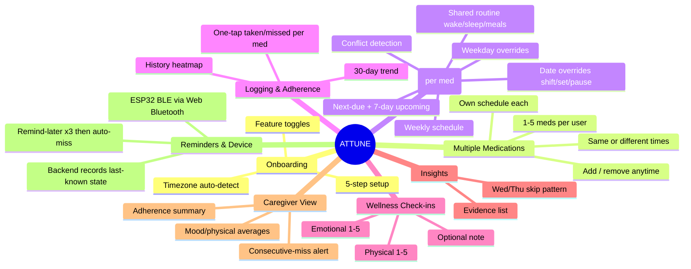
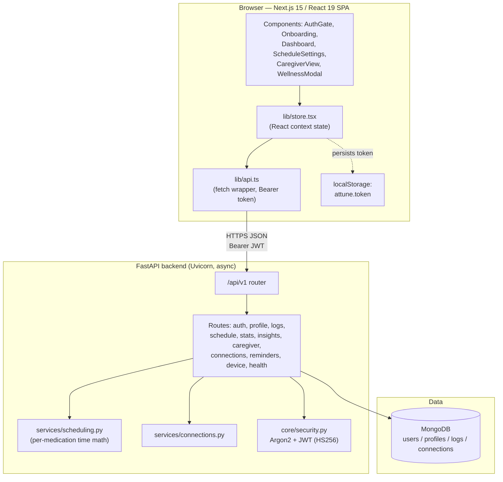
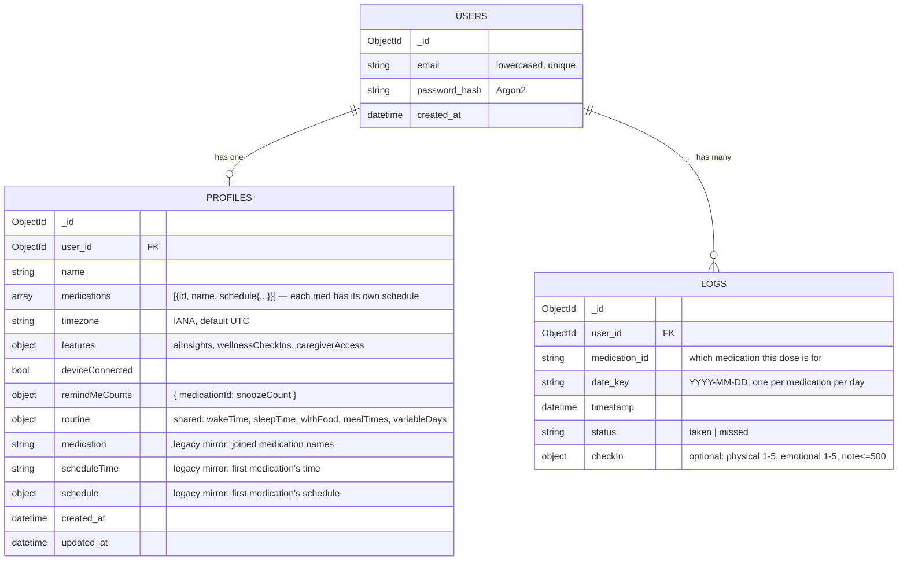
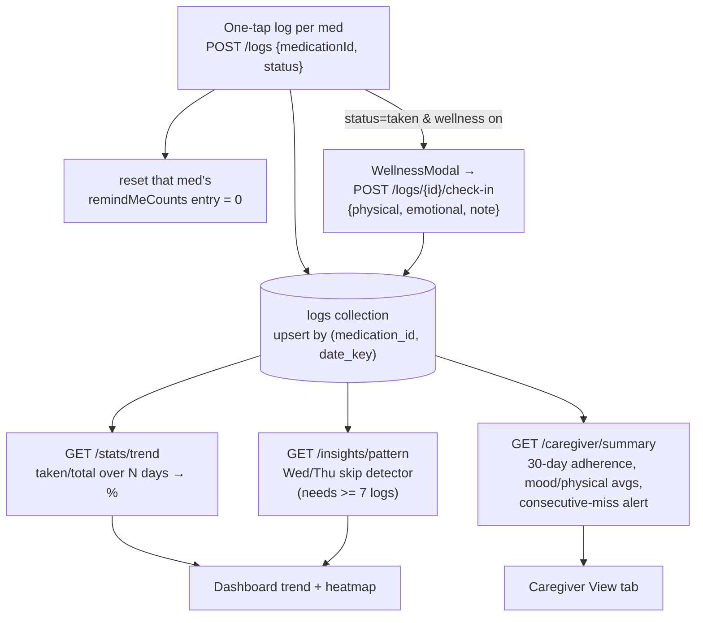
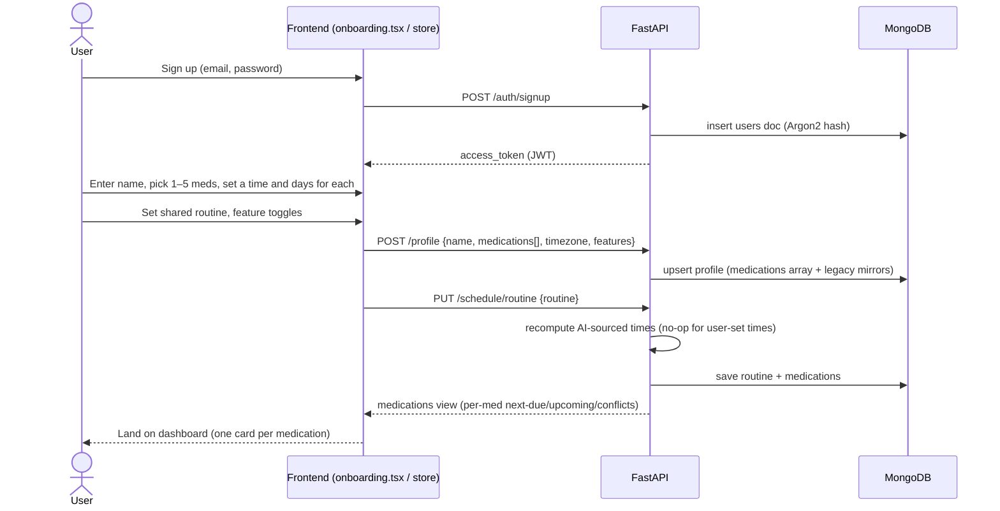
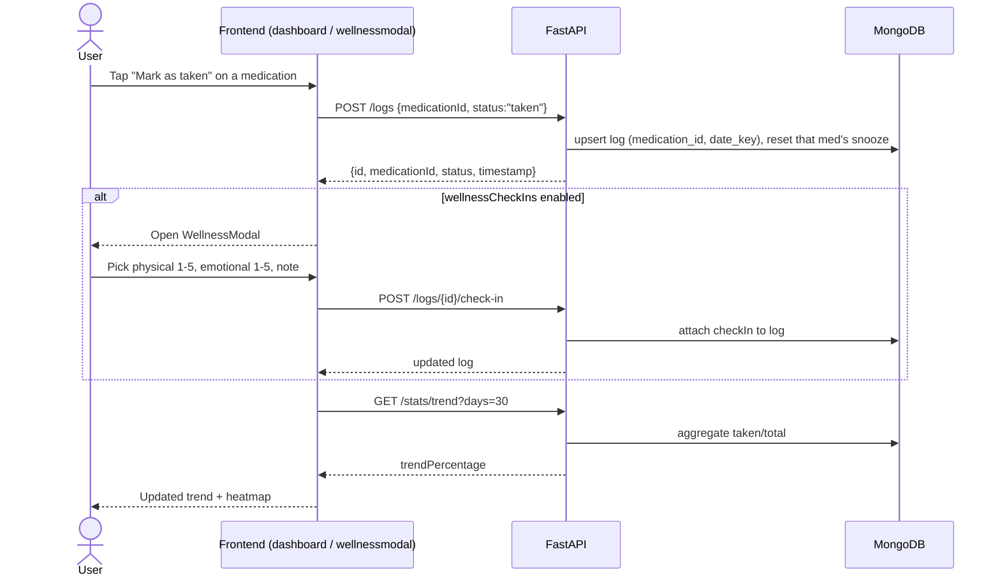
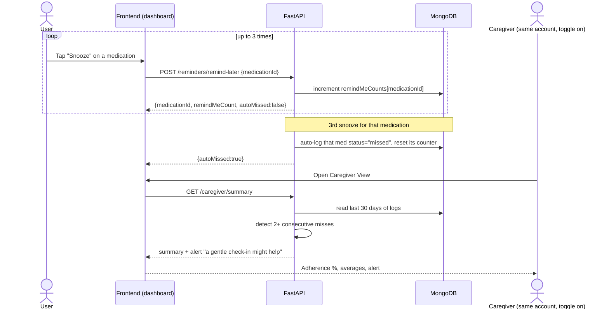

# ATTUNE — Software Overview

*A technical orientation for someone new to the codebase. Generated from the repository on 2026-06-15.*

> **How to read this doc:** every claim here was checked against the actual code in `backend/` and `frontend/`. Where something was **inferred** rather than confirmed from code, it is tagged **[ASSUMPTION]** so you can correct it.

---

## 1. Summary

**ATTUNE is a medication-adherence web app — paired with an optional ESP32 pill device the browser connects to directly over Bluetooth Low Energy — that removes the guesswork from *when* to take medications and makes consistency visible over time.** During a short onboarding, the user names one or more medications and sets a time and days for each — they can share a time or sit at completely different times. Each medication's time-of-day window is resolved to a concrete clock time against the user's own daily routine (wake/sleep/meals), then surfaced as a per-medication, one-tap "taken / remind me later" home screen, an adherence trend, optional wellness check-ins, a rule-based pattern insight, and an optional caregiver summary. It solves the fact that medication non-adherence is driven as much by *friction and uncertainty* ("when am I even supposed to take this?") as by forgetting — so the product answers the "when," lowers setup friction, and keeps both the patient and the people who support them in the loop.

---

## 2. Users & Roles

ATTUNE today is a **single-account application**: one person signs up, onboards, and uses the app. There is **no separate login or invite for a distinct caregiver** — the "caregiver view" is a tab *within the patient's own account*, unlocked by a feature toggle. The roles below are therefore product-level personas served by one technical account type, except where noted.

| Role | Who they are | What they need | How the code serves them | Permissions / gating |
|---|---|---|---|---|
| **Patient / primary user** | An adult on a new prescription, an elderly patient, or a wellness/supplement user | Get the timing right, log doses with one tap, see their consistency | Full app: onboarding, dashboard, schedule settings, logging, insights | Authenticated account (email + password, JWT bearer token) |
| **Caregiver (as a view)** | A family member or doctor the patient wants to share with | Visibility into adherence %, missed doses, mood/physical averages, an alert on consecutive misses | `GET /caregiver/summary` + the "Caregiver View" tab | Same account; gated by `features.caregiverAccess === true`. Returns HTTP 403 (`caregiver_access_disabled`) if the toggle is off **[ASSUMPTION: caregiver is the same human or a trusted person physically/credential-sharing the patient account — code has no second identity]** |
| **Developer / operator** | Whoever runs the app locally | Seed data, drive the API, health checks | `backend/scripts/` (`seed_logs.py`, `drive_app.py`, `test_schedule.py`), `GET /healthz` | Local shell access |

There is **no admin role, no role-based access control, and no multi-tenant separation** beyond "a user can only read/write their own `user_id`-scoped documents."

---

## 3. Features

Grouped by area; each line reflects code that exists today.

**Onboarding & profile**
- 5-step guided setup: name → medications (pick 1–5, name each) → per-medication when-to-take (time + days, same or different) → daily routine → feature toggles (`frontend/components/onboarding.tsx`).
- Browser-detected timezone stored as an IANA zone on the profile.

**Multiple medications**
- 1–5 medications per user, **each with its own independent schedule** (time + days). Two meds can share a time or be at completely different times.
- Add or remove medications after onboarding from Schedule settings (`POST` / `DELETE /schedule/medications`); the last medication can't be removed.
- One shared routine (wake/sleep/meals) across all medications.

**Scheduling** (per medication)
- Each medication has its own default weekly schedule (time + days of week).
- Per-weekday overrides and date-range overrides (`shift` / `set` / `pause`, pause wins), scoped to a medication.
- Shared routine model (wake/sleep, with-food + meal times, variable days); changing routine re-derives every AI-sourced dose time.
- Conflict detection (outside awake hours, not near a meal when with-food, overlapping overrides), per medication.
- Per-medication next-due + 7-day upcoming forecast.

**Logging & adherence**
- One-tap `taken` / `missed` log **per medication**, one entry per medication per day (upsert by `(medication, date_key)`).
- 30-day adherence trend percentage across all medications (`/stats/trend`).
- Calendar/heatmap of recent history in the dashboard (a day is flagged if any medication was missed).

**Wellness check-ins (optional toggle)**
- Post-dose modal: physical (1–5), emotional (1–5), optional note (≤500 chars), attached to the day's log.

**Caregiver view (optional toggle)**
- 30-day summary: adherence %, missed doses, avg physical/mood, recent activity, alert on 2+ consecutive misses.

**Reminders & device**
- Per-medication "Remind me later" counter; auto-logs that medication `missed` after 3 snoozes.
- Real ESP32 device connection over Bluetooth Low Energy via the browser's Web Bluetooth API. The browser talks to the device directly (`frontend/lib/bluetooth.ts`, firmware in `firmware/attune_ble/attune_ble.ino`); the backend only records the last-known connected state (`POST /device {connected}`).

### Diagram — Feature map (Mermaid mindmap)

---

## 4. Architecture

Two independently-running processes: a **Next.js frontend** (browser SPA) and a **Python/FastAPI backend**, talking over a JSON REST API at `/api/v1`. The backend persists to **MongoDB**. There are no external API calls in the backend; all scheduling/time math is local.

### Diagram — System architecture (Mermaid flowchart)

**Key architectural facts (from code):**
- Auth is stateless: `create_access_token` (HS256, 7-day expiry) → bearer token → `get_current_user` decodes it and loads the `users` document on every protected request.
- CORS is restricted to `CORS_ORIGINS` (default `http://localhost:3000`).
- `services/scheduling.py` holds **all time math** (window→clock-time resolution, overrides, conflicts, next-due) and is timezone-aware via `ZoneInfo`. It runs **per medication** — each medication carries its own schedule, while the routine is shared across all of a user's medications.
- `services/connections.py` handles caregiver connection codes / linking.

---

## 5. Data Model

Three MongoDB collections. Documents are scoped to a user via `user_id`. The `profiles` document carries a `medications` array (each medication with its own nested `schedule`) plus one shared `routine` sub-document. Legacy flat fields (`medication`, `scheduleTime`, `schedule`) are kept in sync as mirrors so older readers keep working; profiles created before multi-medication support migrate lazily to a one-element `medications` array (id `"primary"`).

### Diagram — Data model (Mermaid erDiagram)

**Notable details:**
- **One log per medication per day** — logging upserts on `(user_id, medication_id, date_key)`. Legacy logs with no `medication_id` are read as belonging to the `"primary"` medication.
- Each entry in `medications[]` is `{id, name, schedule}`; `schedule.source` is `"ai"` or `"user"`, and only `"ai"`-sourced times get re-derived when the (shared) routine changes.
- `schedule.dateOverrides[]` entries carry `{id, start, end, type, note}` plus `shiftMinutes` (type `shift`, ±720) or `time` (type `set`), scoped to that medication.
- `remindMeCounts` is a per-medication snooze counter; a medication auto-logs `missed` after 3 snoozes.
- `features` defaults: `aiInsights=true`, `wellnessCheckIns=true`, `caregiverAccess=false`.

---

## 6. Data Pipelines

The pipeline that matters most: **dose logging → adherence / insights / caregiver**, which runs daily. (Onboarding writes the medications + their schedules directly; see Flow 1 in §8 — there is no external lookup step.)

### Diagram — Logging → adherence, insights, caregiver (Mermaid flowchart)

---

## 7. Key User Flows

### Diagram — Flow 1: Onboarding (Mermaid sequence)

### Diagram — Flow 2: Daily dose log + wellness check-in (Mermaid sequence)

### Diagram — Flow 3: Reminder snooze → auto-miss, and caregiver alert (Mermaid sequence)

---

## 8. PRD Field Extract

This table reports only **what the repository actually shows** for each field — it makes no comparison to any PRD and no judgement about whether the code matches a spec.

| PRD Field | What the Repo Shows |
|---|---|
| **Product Overview** | A medication-adherence web app for one or more medications — each with its own time and days (the same time, or different times) — that fits each dose to the user's daily routine and provides per-medication one-tap logging, an adherence trend, optional wellness check-ins, a rule-based pattern insight, and an optional caregiver summary. (Confirmed by `product-skeleton.md` and the implemented routes/services.) |
| **Who it's for** | A single authenticated patient/primary user (adults on a new prescription, elderly patients, or wellness/supplement users). A "caregiver" is served as a *view within the same account* gated by `features.caregiverAccess`, not a separate identity. No admin/role system in code. |
| **Priority Features** | Implemented in code: email+password auth (JWT/Argon2); 5-step onboarding; **multiple medications (1–5), each with its own routine-aware schedule** (weekday + date overrides, conflict detection); add/remove medications post-onboarding; per-medication next-due + 7-day upcoming; per-medication one-tap taken/missed logging; 30-day trend; Wed/Thu pattern insight; wellness check-ins; caregiver summary with consecutive-miss alert; per-medication remind-later→auto-miss; ESP32 device connection over BLE (browser Web Bluetooth; backend records last-known state). |
| **Core Workflow** | **Trigger:** a medication's scheduled dose is due (dashboard shows a per-medication "next dose" card). **Action:** for that medication the user taps "Mark as taken" (or "Snooze"), optionally completing a wellness check-in. **Result:** that medication's day log is upserted, its snooze counter resets, and the trend/heatmap/insight/caregiver summary update. |
| **Aha Moment** | During onboarding the user names one or more medications and gives each its own time and days — the same time or different times — and the dashboard immediately shows a per-medication next-dose card, each resolved to their routine and timezone and independently loggable, instead of a single blank time field. |
| **Inputs** | Email + password; user's name; **one to five medication names, each with its own window/exact time + days of week**; shared routine (wake/sleep, with-food + meal times, variable days); browser-detected IANA timezone; feature toggles; per-medication dose status (`taken`/`missed`); wellness check-in (physical 1–5, emotional 1–5, note ≤500 chars); per-medication schedule overrides (weekday, date-range shift/set/pause). |
| **Outputs** | A resolved **per-medication** weekly schedule with next-due + 7-day upcoming + conflict warnings; adherence trend percentage across all medications; recent-history heatmap; a Wed/Thu pattern message with evidence; a caregiver summary (adherence %, missed count, avg physical/mood, recent activity, consecutive-miss alert); device connected/disconnected flag. |
| **Use of AI** | Only the **pattern insight** — a deterministic, rule-based detector (Wed/Thu misses in the last 8 occurrences, ≥4 threshold), no model and no external calls. No LLM or external drug-data lookup exists in the backend. |
| **MVP Scope** | 1–5 medications per user, each with its own schedule. Fully implemented FastAPI backend (auth/profile/logs/schedule/stats/insights/caregiver/connections/reminders/device/health) + Next.js frontend (onboarding, dashboard, schedule settings, caregiver view, wellness modal). Caregiver is a same-account view. Device connects over BLE (Web Bluetooth → ESP32); backend stores only the last-known connected flag. |
| **Constraints / Must Not Do** | Up to 5 medications per user, each independently scheduled; **no drug–drug interaction checking** (the free NLM RxNav interaction API was discontinued). API key never hardcoded/committed (lives in gitignored `.env`). One log per medication per day. Auth required on all endpoints except `/healthz`, `/auth/signup`, `/auth/login`. CORS restricted to configured origins. |

---

## 10. Assumptions & Open Questions

**Assumptions made while documenting (correct me if wrong):**
- **[ASSUMPTION]** The "caregiver" (as a same-account view) is either the patient themselves reviewing their data or a trusted person using the patient's credentials — the code has no second identity for it; a separate caregiver login/link does exist via the `connections` route and connection codes.
- The physical pill device is integrated over Bluetooth Low Energy: the browser connects directly to an ESP32 (GATT server "Attune Device") via the Web Bluetooth API (`frontend/lib/bluetooth.ts`, firmware `firmware/attune_ble/attune_ble.ino`). The backend (`device.py`) is *not* in the radio path — it only persists the last-known `deviceConnected` flag via `POST /device {connected}` so it survives a refresh. Web Bluetooth requires Chrome/Edge/Opera and a secure context (https or `http://localhost`).
- The grounded **drug-timing AI suggestion** (RxNorm/OpenFDA/LLM) described in earlier drafts and `product-skeleton.md` is **not built** — there is no `drug_timing.py`, no `/schedule/suggest` endpoint, and no external/LLM calls in the backend. Dose times are entered manually and resolved locally.

**Open questions surfaced (some flagged in `product-skeleton.md`):**
- Post-setup landing: should the user land on the calendar, the next-dose home, or the first scheduled dose? (Marked in-progress.)
- Multiple medications (1–5) are now supported and can be added/removed post-onboarding from Schedule settings — should the cap be raised, and should adherence/insights be reported per-medication rather than aggregate?
- What is the UX for an unrecognized medication name beyond degrading to the manual picker?
- Is there any token revocation/refresh story? (`/auth/logout` is a no-op; JWTs simply expire after 7 days.)
- The pattern insight is hard-coded to **Wednesday/Thursday** misses — is that intended as the only pattern, or a placeholder for a more general detector?

---

*End of overview.*
