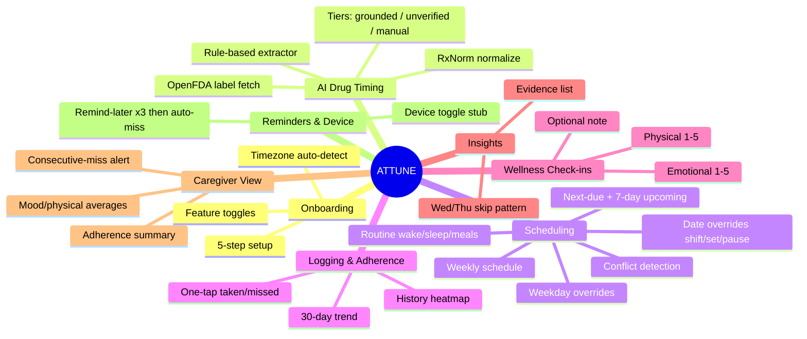
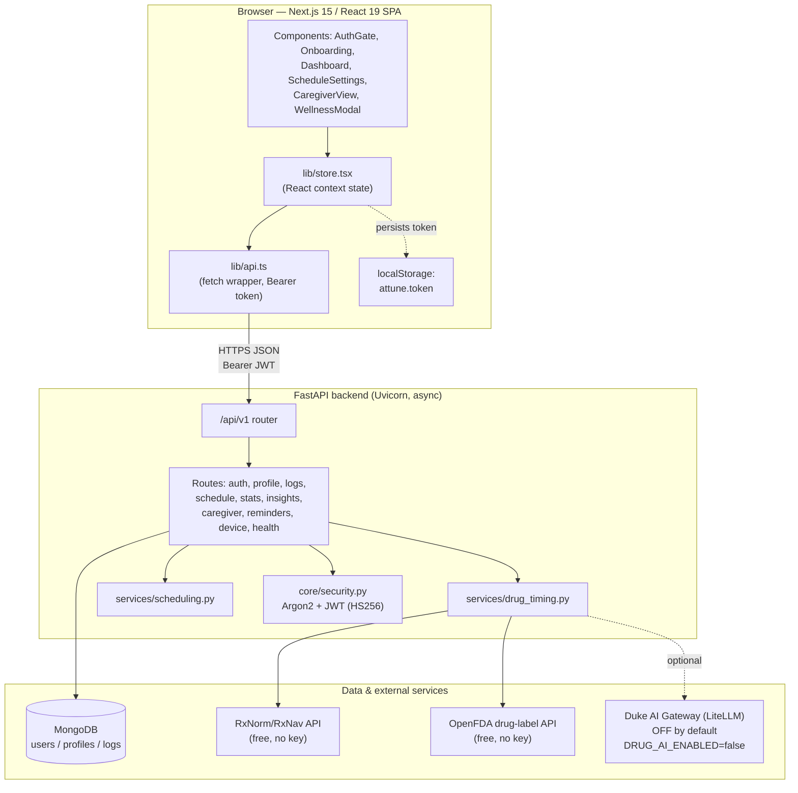
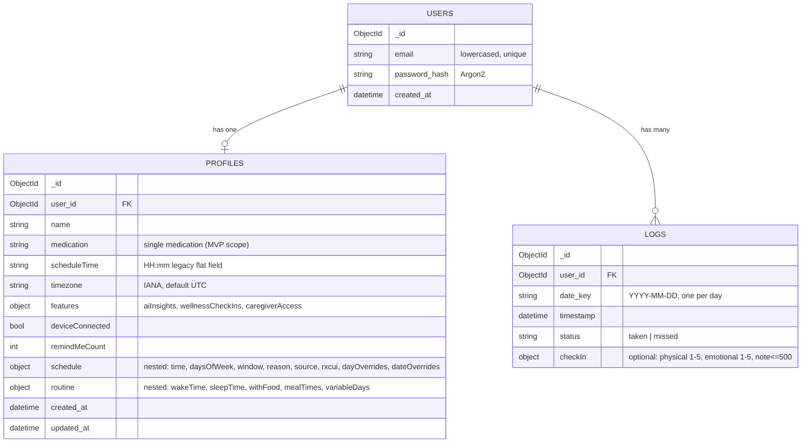
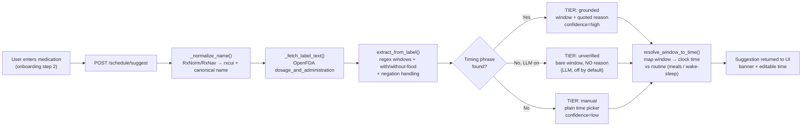
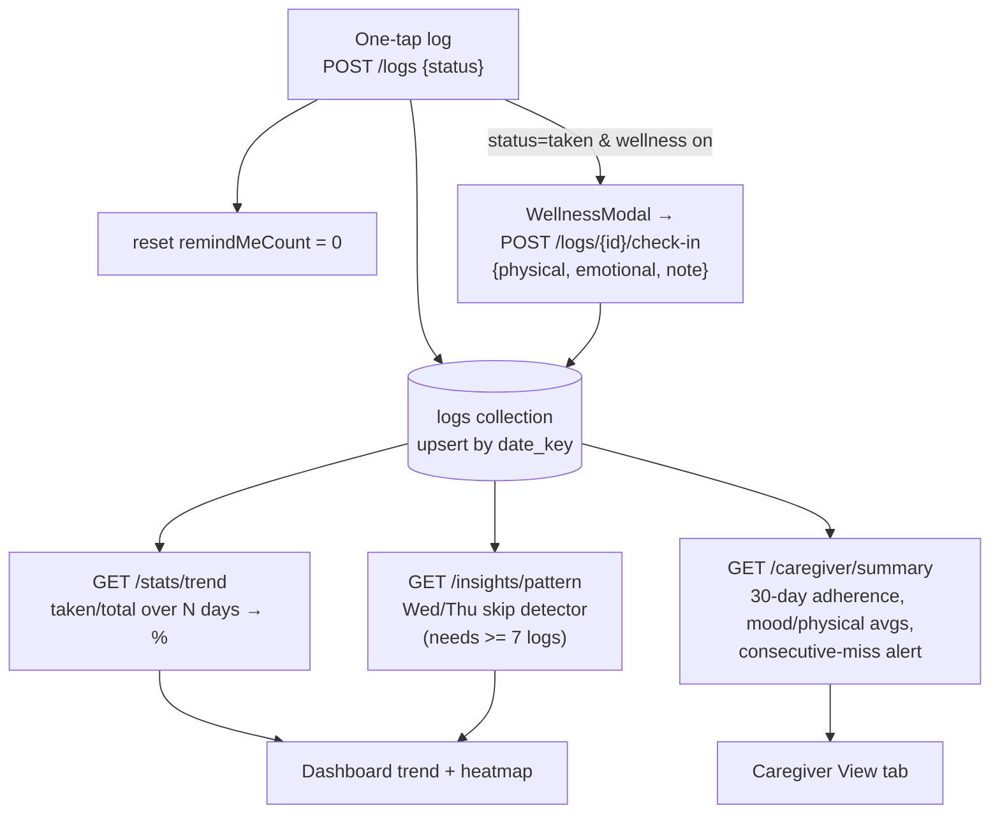
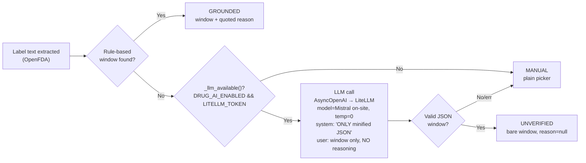
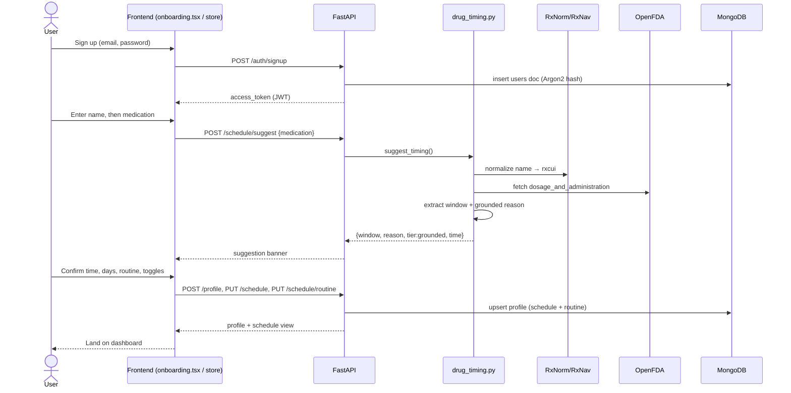
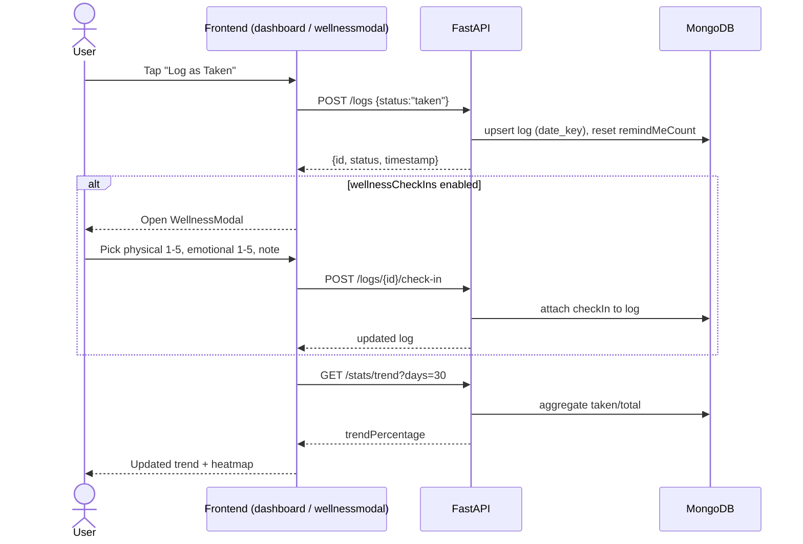

# ATTUNE — Software Overview

*A technical orientation for someone new to the codebase. Generated from the repository on 2026-06-04.*

> **How to read this doc:** every claim here was checked against the actual code in `backend/` and `frontend/`. Where something was **inferred** rather than confirmed from code, it is tagged **[ASSUMPTION]** so you can correct it.

---

## 1. Summary

**ATTUNE is a medication-adherence web app — paired with an optional (currently stubbed) physical pill device — that removes the guesswork from *when* to take a medication and makes consistency visible over time.** During a short onboarding, the user names one medication; the backend normalizes the drug via RxNorm/RxNav, pulls the real "dosage & administration" text from the OpenFDA drug-label API, and uses a rule-based extractor to propose a time-of-day window grounded in a quote from that label. That window is resolved to a concrete clock time against the user's own daily routine (wake/sleep/meals), then surfaced as a one-tap "taken / remind me later" home screen, an adherence trend, optional wellness check-ins, a rule-based pattern insight, and an optional caregiver summary. It solves the fact that medication non-adherence is driven as much by *friction and uncertainty* ("when am I even supposed to take this?") as by forgetting — so the product answers the "when," lowers setup friction, and keeps both the patient and the people who support them in the loop.

---

## 2. Users & Roles

ATTUNE today is a **single-account application**: one person signs up, onboards, and uses the app. There is **no separate login or invite for a distinct caregiver** — the "caregiver view" is a tab *within the patient's own account*, unlocked by a feature toggle. The roles below are therefore product-level personas served by one technical account type, except where noted.

| Role | Who they are | What they need | How the code serves them | Permissions / gating |
|---|---|---|---|---|
| **Patient / primary user** | An adult on a new prescription, an elderly patient, or a wellness/supplement user | Get the timing right, log doses with one tap, see their consistency | Full app: onboarding, dashboard, schedule settings, logging, insights | Authenticated account (email + password, JWT bearer token) |
| **Caregiver (as a view)** | A family member or doctor the patient wants to share with | Visibility into adherence %, missed doses, mood/physical averages, an alert on consecutive misses | `GET /caregiver/summary` + the "Caregiver View" tab | Same account; gated by `features.caregiverAccess === true`. Returns HTTP 403 (`caregiver_access_disabled`) if the toggle is off **[ASSUMPTION: caregiver is the same human or a trusted person physically/credential-sharing the patient account — code has no second identity]** |
| **Developer / operator** | Whoever runs the app locally | Seed data, drive the API, health checks | `backend/scripts/` (`seed_logs.py`, `drive_app.py`, `test_schedule.py`), `GET /healthz` | Local shell access |

There is **no admin role, no role-based access control, and no multi-tenant separation** beyond "a user can only read/write their own `user_id`-scoped documents."

---

## 3. Features

Grouped by area; each line reflects code that exists today.

**Onboarding & profile**
- 5-step guided setup: name → medication → when-to-take → daily routine → feature toggles (`frontend/components/onboarding.tsx`).
- Browser-detected timezone stored as an IANA zone on the profile.

**AI / drug-timing suggestion (the differentiator)**
- Drug-name normalization via RxNorm/RxNav (`/REST/rxcui.json`).
- Real label fetch from OpenFDA (`/drug/label.json`).
- Rule-based time-of-day window + grounded "why" extraction, with negation handling (`backend/app/services/drug_timing.py`).
- Three confidence tiers: **grounded** (quote from label) / **unverified** (optional LLM, off by default) / **manual** (plain picker).

**Scheduling**
- Default weekly schedule (time + days of week).
- Per-weekday overrides and date-range overrides (`shift` / `set` / `pause`, pause wins).
- Routine model (wake/sleep, with-food + meal times, variable days); changing routine re-derives AI-sourced dose time.
- Conflict detection (outside awake hours, not near a meal when with-food, overlapping overrides).
- Next-due + 7-day upcoming forecast.

**Logging & adherence**
- One-tap `taken` / `missed` log, one entry per day (upsert by `date_key`).
- 30-day adherence trend percentage (`/stats/trend`).
- Calendar/heatmap of recent history in the dashboard.

**Wellness check-ins (optional toggle)**
- Post-dose modal: physical (1–5), emotional (1–5), optional note (≤500 chars), attached to the day's log.

**Insights (rule-based, free)**
- Wed/Thu skip-pattern detector with evidence (`/insights/pattern`), gated on a minimum log count.

**Caregiver view (optional toggle)**
- 30-day summary: adherence %, missed doses, avg physical/mood, recent activity, alert on 2+ consecutive misses.

**Reminders & device**
- "Remind me later" counter; auto-logs `missed` after 3 snoozes.
- Device connected/disconnected toggle (a stub standing in for hardware).

### Diagram — Feature map (Mermaid mindmap)

---

## 4. Architecture

Two independently-running processes: a **Next.js frontend** (browser SPA) and a **Python/FastAPI backend**, talking over a JSON REST API at `/api/v1`. The backend persists to **MongoDB** and calls two **free external data sources** (RxNorm/RxNav, OpenFDA). An **optional LLM** (Duke AI Gateway via the OpenAI SDK) is wired in but **off by default**.

### Diagram — System architecture (Mermaid flowchart)

**Key architectural facts (from code):**
- Auth is stateless: `create_access_token` (HS256, 7-day expiry) → bearer token → `get_current_user` decodes it and loads the `users` document on every protected request.
- CORS is restricted to `CORS_ORIGINS` (default `http://localhost:3000`).
- `services/scheduling.py` holds **all time math** (window→clock-time resolution, overrides, conflicts, next-due) and is timezone-aware via `ZoneInfo`.
- `services/drug_timing.py` is the only place external drug APIs (and the optional LLM) are called.

---

## 5. Data Model

Three MongoDB collections. Documents are scoped to a user via `user_id`. The `profiles` document carries two nested sub-documents (`schedule`, `routine`); a legacy flat `scheduleTime` field is kept in sync for backward compatibility.

### Diagram — Data model (Mermaid erDiagram)

**Notable details:**
- **One log per user per day** — logging upserts on `(user_id, date_key)`.
- `schedule.source` is `"ai"` or `"user"`; only `"ai"`-sourced times get re-derived when the routine changes.
- `schedule.dateOverrides[]` entries carry `{id, start, end, type, note}` plus `shiftMinutes` (type `shift`, ±720) or `time` (type `set`).
- `features` defaults: `aiInsights=true`, `wellnessCheckIns=true`, `caregiverAccess=false`.

---

## 6. Data Pipelines

Two pipelines matter most: **(A) the drug-timing suggestion** that runs during onboarding, and **(B) dose logging → adherence/insights** that runs daily.

### Diagram — Pipeline A: drug-timing suggestion (Mermaid flowchart)

### Diagram — Pipeline B: logging → adherence, insights, caregiver (Mermaid flowchart)

---

## 7. Use of AI

### Where AI is (and isn't)

| Surface | Technique | Model | Default | Status |
|---|---|---|---|---|
| **Drug-timing "why" extraction** | Rule-based regex over real FDA label text, with negation filtering | None (deterministic code) | Always on | Built; this is the primary "AI" experience |
| **Unverified timing fallback** | LLM completion (OpenAI-compatible chat) constrained to return *only* a window, JSON, temperature 0, **forbidden from inventing a justification** | Duke AI Gateway / LiteLLM, `LITELLM_MODEL` default `"Mistral on-site"` (free) | **OFF** (`DRUG_AI_ENABLED=false`) | Built but gated; only fires when label has no usable timing |
| **Pattern insight** | Rule-based statistical detector (Wed/Thu misses in last 8 occurrences, ≥4 threshold) | None | On if `aiInsights` toggle | Built (no LLM) |

**Why AI/this design fits here:** the product's hardest job is answering "when should I take this?" *trustworthily*. A free-text medical chatbot would risk inventing advice, so the design deliberately makes the **rule-based, label-grounded extractor the default** and treats the LLM as an optional, justification-free fallback. This matches the project's guardrail that timing suggestions **must be free and grounded, and never surface an ungrounded "why."** The "pattern insight" is branded as AI but is a transparent, free heuristic — chosen because it is explainable and cannot hallucinate.

> **[ASSUMPTION]** The label "AI" in the product is largely marketing for a rule-based pipeline plus an optional LLM. The code confirms the LLM path exists; I have **not** confirmed it has ever been exercised with a live `LITELLM_TOKEN`, since the flag defaults off.

### Diagram — The AI/LLM step inside the timing pipeline (Mermaid flowchart)

---

## 8. Key User Flows

### Diagram — Flow 1: Onboarding with grounded timing suggestion (Mermaid sequence)

### Diagram — Flow 2: Daily dose log + wellness check-in (Mermaid sequence)

### Diagram — Flow 3: Reminder snooze → auto-miss, and caregiver alert (Mermaid sequence)

---

## 9. PRD Field Extract

This table reports only **what the repository actually shows** for each field — it makes no comparison to any PRD and no judgement about whether the code matches a spec.

| PRD Field | What the Repo Shows |
|---|---|
| **Product Overview** | A medication-adherence web app that looks up *when* to take one medication from the real FDA label, fits it to the user's routine, and provides one-tap logging, an adherence trend, optional wellness check-ins, a rule-based pattern insight, and an optional caregiver summary. (Confirmed by `product-skeleton.md` and the implemented routes/services.) |
| **Who it's for** | A single authenticated patient/primary user (adults on a new prescription, elderly patients, or wellness/supplement users). A "caregiver" is served as a *view within the same account* gated by `features.caregiverAccess`, not a separate identity. No admin/role system in code. |
| **Priority Features** | Implemented in code: email+password auth (JWT/Argon2); 5-step onboarding; drug-timing suggestion (RxNorm + OpenFDA + rule-based, 3 tiers); routine-aware schedule with weekday + date overrides and conflict detection; next-due + 7-day upcoming; one-tap taken/missed logging; 30-day trend; Wed/Thu pattern insight; wellness check-ins; caregiver summary with consecutive-miss alert; remind-later→auto-miss; device toggle stub. |
| **Core Workflow** | **Trigger:** a scheduled dose is due (dashboard shows "next dose" + reason). **Action:** user taps "Log as Taken" (or "Remind me later"), optionally completes a wellness check-in. **Result:** the day's log is upserted, `remindMeCount` resets, and the trend/heatmap/insight/caregiver summary update. |
| **Aha Moment** | During onboarding step 3: the user types one medication and ATTUNE returns a **grounded** timing suggestion — a window *plus a real sentence quoted from the FDA label* — resolved to a concrete time against their routine, instead of a blank time field. (`POST /schedule/suggest` → `tier:"grounded"`.) |
| **Inputs** | Email + password; user's name; one medication name; chosen window/exact time + days of week; routine (wake/sleep, with-food + meal times, variable days); browser-detected IANA timezone; feature toggles; dose status (`taken`/`missed`); wellness check-in (physical 1–5, emotional 1–5, note ≤500 chars); schedule overrides (weekday, date-range shift/set/pause). |
| **Outputs** | A grounded/unverified/manual timing suggestion; a resolved weekly schedule with next-due + 7-day upcoming + conflict warnings; adherence trend percentage; recent-history heatmap; a Wed/Thu pattern message with evidence; a caregiver summary (adherence %, missed count, avg physical/mood, recent activity, consecutive-miss alert); device connected/disconnected flag. |
| **Use of AI** | (1) Default path is **rule-based** (no model): regex extraction of a timing window + quoted reason from FDA label text, with negation handling. (2) Optional **LLM** via Duke AI Gateway / LiteLLM (OpenAI SDK, `AsyncOpenAI`, `LITELLM_MODEL` default `"Mistral on-site"`, temp 0), gated behind `DRUG_AI_ENABLED=false`, constrained to return a bare window with `reason:null` and forbidden from inventing justification. (3) Pattern insight is a rule-based heuristic, no model. |
| **MVP Scope** | One medication per user. Fully implemented backend (25 endpoints across auth/profile/logs/schedule/stats/insights/caregiver/reminders/device/health) + Next.js frontend (onboarding, dashboard, schedule settings, caregiver view, wellness modal). Caregiver is a same-account view. Device is a boolean toggle. LLM path present but off. |
| **Constraints / Must Not Do** | Single medication only (no multi-med/polypharmacy/interaction checks — RxNav interaction API noted as discontinued). Timing "why" must be **grounded** (quoted from label); the unverified LLM tier must **not** surface a justification (`reason:null`). LLM is off by default and uses the free model to avoid budget. API key never hardcoded/committed (lives in gitignored `.env`). One log per user per day. Auth required on all endpoints except `/healthz`, `/auth/signup`, `/auth/login`. CORS restricted to configured origins. |

---

## 10. Assumptions & Open Questions

**Assumptions made while documenting (correct me if wrong):**
- **[ASSUMPTION]** The "caregiver" is either the patient themselves reviewing their data or a trusted person using the patient's credentials — the code has no second identity, invite, or separate caregiver login.
- **[ASSUMPTION]** The optional LLM path has not necessarily been exercised against a live Duke Gateway key, since `DRUG_AI_ENABLED` defaults to `false`; I confirmed the code path exists, not that it has run in production.
- **[ASSUMPTION]** The physical pill device is not integrated at all — `device.py` is a pure boolean toggle with no hardware/BLE/push code, consistent with the skeleton calling it a stub.
- **[ASSUMPTION]** `httpx` is the async HTTP client used by `drug_timing.py` (the import is used in code) even though it is not pinned in `requirements.txt`; it appears to be relied on as an available dependency.

**Open questions surfaced (some flagged in `product-skeleton.md`):**
- Post-setup landing: should the user land on the calendar, the next-dose home, or the first scheduled dose? (Marked in-progress.)
- Can a second medication be added post-onboarding? (Today: no — single-medication scope.)
- What is the UX for an unrecognized medication name beyond degrading to the manual picker?
- Is there any token revocation/refresh story? (`/auth/logout` is a no-op; JWTs simply expire after 7 days.)
- The pattern insight is hard-coded to **Wednesday/Thursday** misses — is that intended as the only pattern, or a placeholder for a more general detector?

---

*End of overview.*
